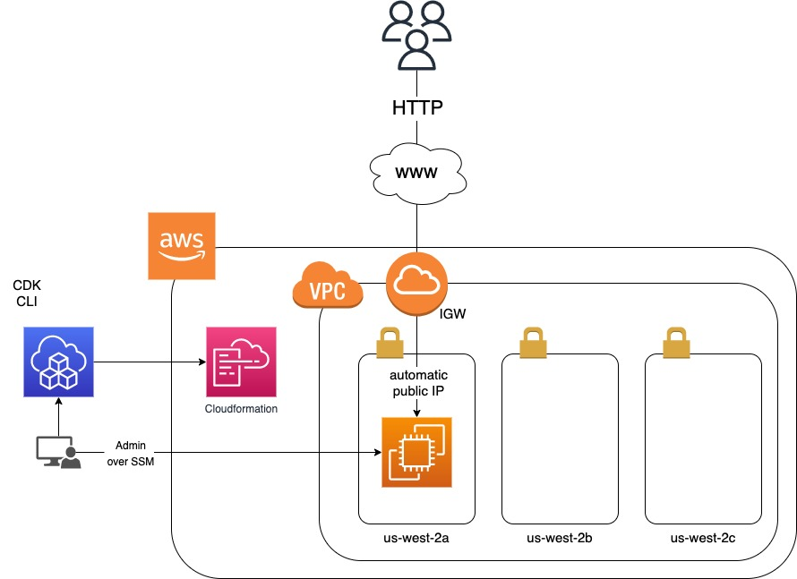

# Welcome to Conrado's EC2 CDK demo

This is a CDK demo buildt with TypeScript. The infrastructure we will built in
this demo looks like this:



## Requirements

- this was built using node v18.17.1, use your prefered method to install node,
  it may work on other node versions. I like to use [nvm](https://github.com/nvm-sh/nvm). With nvm you may:
  ```console
  nvm install v18
  nvm use v18
  ```
- cdk cli is needed, once you have your node you can install it with:
  ```console
  npm install -g aws-cdk
  ```
- an aws account is required. the
  [aws-cli should be installed](https://docs.aws.amazon.com/cli/latest/userguide/getting-started-install.html)
  If needed you can see the following docs about
  [opening a free AWS account](https://aws.amazon.com/free/),
  and
  [how to get your AWS Programmatic Access](https://docs.aws.amazon.com/general/latest/gr/aws-sec-cred-types.html).
  Once you have the `aws` cli command installed, and an AWS API key you may
  configure your credentials like so:
  ```console
  aws configure
  ```
  fill in your AWS access key and secret. Use `us-west-2` as your default
  region and `json` as your prefered output format
- your favourite code editor. we're using vs-code

## Getting started

Final steps to get us up and running are:

```console
git clone https://github.com/conrado/ec2-cdk.git
cd ec2-cdk
npm install
```

To ensure this code demo works, use the following three commands

```console
cdk bootstrap   # bootsraps CDK into Cloudformation on your AWS account
cdk deploy      # deploy this stack to your AWS account
npm run test    # perform the jest tests validating correct deployment
```
